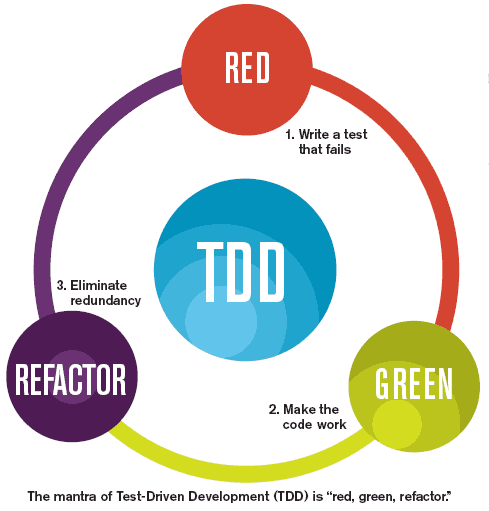
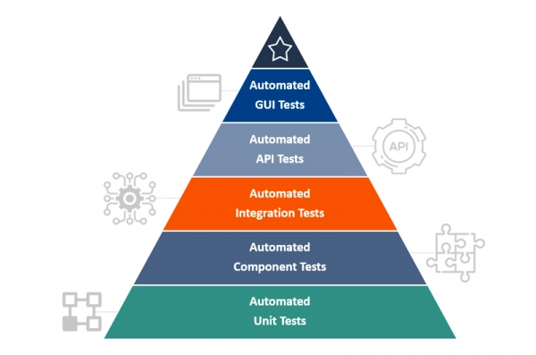
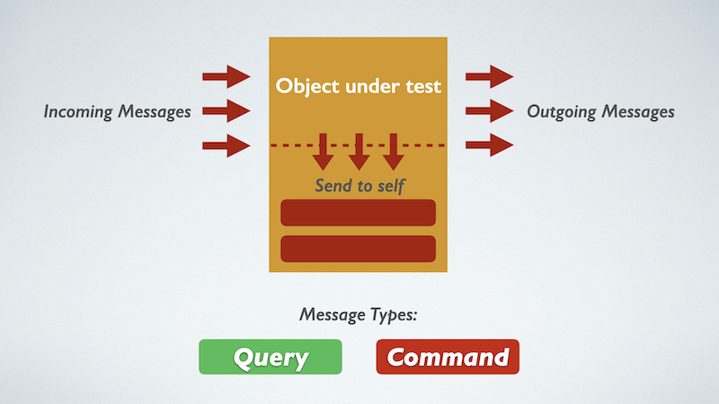
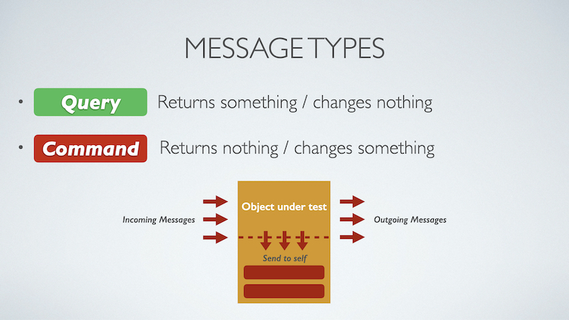
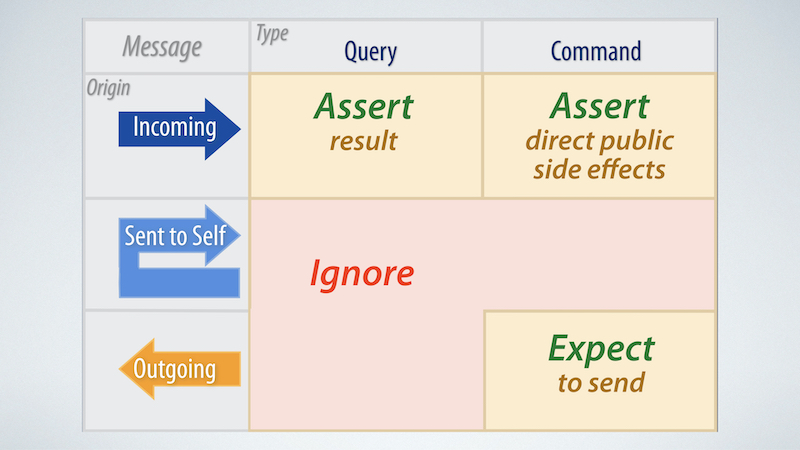

# Test Driven Development

## How?

*(Source: <http://luizricardo.org/wordpress/wp-content/upload-files/2014/05/tdd_flow.gif>)*

## TDD Rules

1. **Start with a test:** only start writing production code when your automated test has failed.
2. **Baby steps:** Only 1 failing test at a time.
3. **Baby tests:** Write small test.
4. Write enough production code to make the failing test pass. No extra code.
5. **Baby steps:** Implement simplest algorithm first, then generate it later when you identify some patterns.
6. Don’t forget about refactoring.
7. Refactor your tests too!
8. Don’t refactor when your tests are failing. Make tests pass first.

## How much should we test?

### Goals of Test Suite

- Tests should be thorough
- Tests should be stable
- Tests should be fast
- Tests should be few (minimal)

### Test Driven Development

- We use test cases to guide the design of our code
- 2 approaches to testing - **Inside Out** and **Outside In**
    - **Outside In** - Use integration tests to guide you
    - **Inside Out** - Build & test individual components, integrate later

### Ratio of Test Types (Testing Pyramid)

*(Source: <https://qatestlab.com/resources/knowledge-center/test-automated-pyramid/>)*

### Flow of Message Types

*(Source: "The Magic Tricks of Testing" - Sandi Metz
 <http://confreaks.tv/videos/railsconf2013-the-magic-tricks-of-testing>)*

## References:

- <https://martinfowler.com/articles/practical-test-pyramid.html>
- <https://speakerdeck.com/miccheng/how-much-should-we-test>